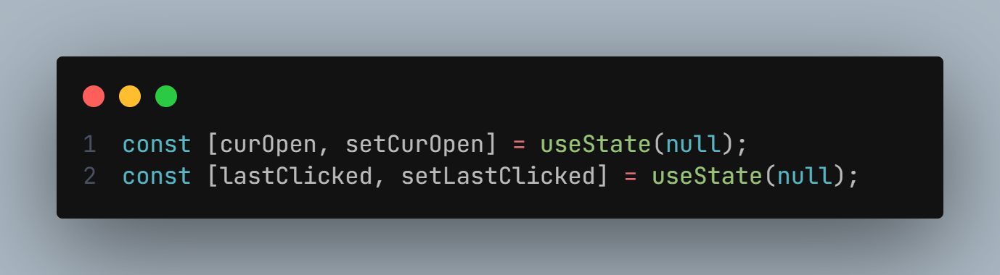
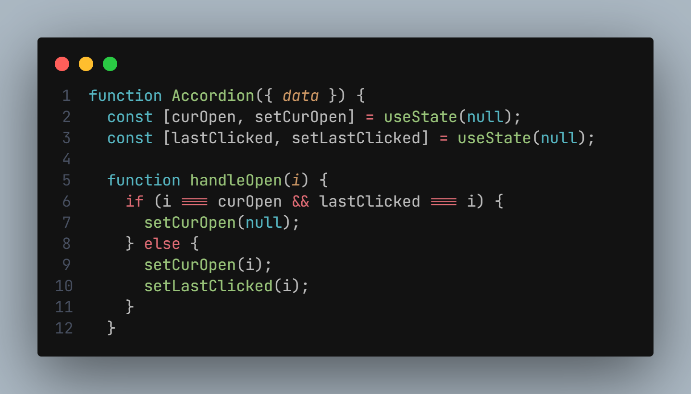
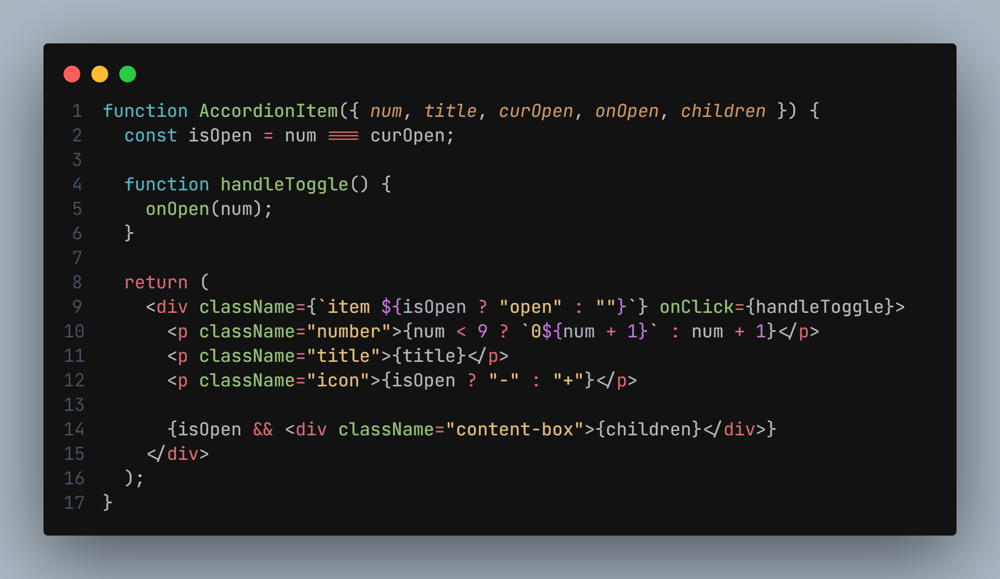
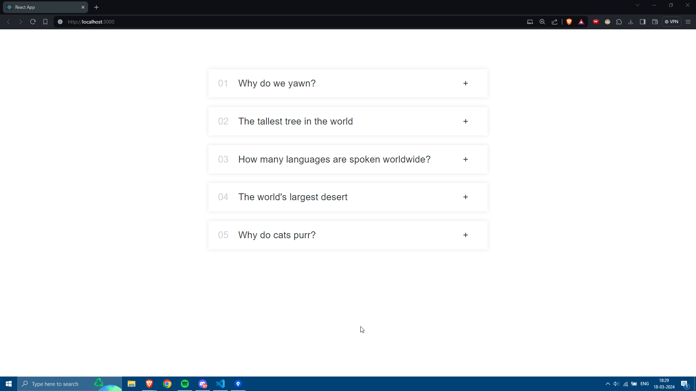
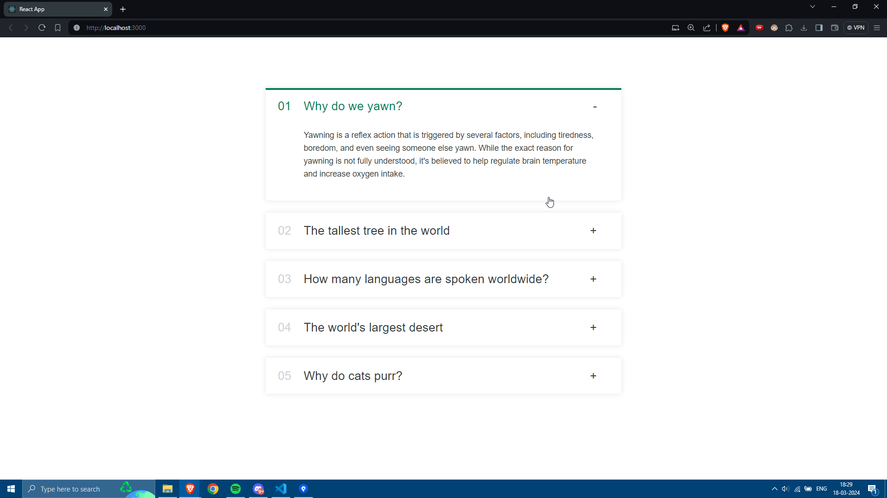
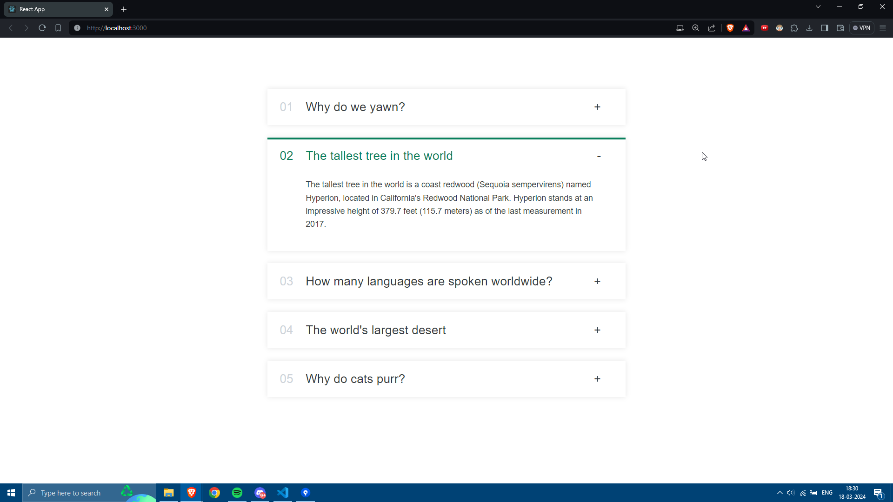

# Accordion Component - React

This is a simple React component called Accordion, designed to display a list of FAQ items with collapsible sections. Each FAQ item consists of a title and accompanying text. Users can click on the titles to expand and collapse the corresponding sections to view more details.

## Getting Started

To use the Accordion component in your React application, follow these steps:

- Clone or download the repository containing the Accordion component code.
- Copy the **App.js** file into your project directory.
- Import the Accordion component into your desired React component file.
- Pass an array of FAQ data to the Accordion component as a prop named data.

## Usage

The **Accordion** component expects an **array of FAQ items** as its data input. Each FAQ item should be an object with the following structure:

## State Management

The Accordion component utilizes React's useState hook to manage the state of which accordion items are currently open.
It keeps track of the index of the currently open item **(curOpen)** and the index of the last clicked item **(lastClicked)** to implement the _double-click closing functionality_.

## Components

The Accordion component consists of two sub-components:

- **Accordion**: The parent component responsible for rendering the list of FAQ items and managing their state.

- **AccordionItem**: The child component representing each individual FAQ item. It receives props such as _title, curOpen, and onOpen_.

## Screenshots

Here are three screenshots demonstrating the functionality of the Accordion component:

- 
  This screenshot shows the Accordion component with no items open.

- 
  This screenshot shows the Accordion component with one item open.

- 
  This screenshot shows the Accordion component with one item open while another is closed. Only one item can be open at a time.

## Contributing

If you encounter any issues or have suggestions for improvements, feel free to open an issue or submit a pull request on the GitHub repository.

---

This README provides a basic overview of the Accordion component, including instructions for usage, customization, contributing, and screenshots demonstrating its functionality. If you have any further questions or need assistance, don't hesitate to ask!
